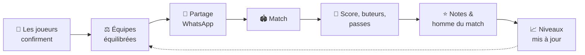

<div align="center">

# ⚽ FiveMaker

**Des équipes équilibrées pour ton five, en un clic.**

Coche les présents, l'appli forme deux équipes du même niveau, partage la compo sur WhatsApp,
puis garde l'historique, les buteurs, les notes et l'évolution de chaque joueur.


</div>

---

## Sommaire

- [Le principe](#-le-principe)
- [Fonctionnalités](#-fonctionnalités)
- [Comment ça marche](#-comment-ça-marche)
- [Rôles dans un groupe](#-rôles-dans-un-groupe)
- [Installation](#-installation)
- [Structure du projet](#-structure-du-projet)
- [Scripts](#-scripts)

---

## 🎯 Le principe

Organiser un five entre potes, c'est toujours la même galère : qui vient, qui joue avec qui, et surtout
**éviter le 10-2 parce que tous les bons sont du même côté**. FiveMaker s'occupe de tout ça :



Plus vous jouez, plus l'équilibrage est juste : les niveaux s'ajustent tout seuls selon les résultats.

---

## ✨ Fonctionnalités

### 👥 Groupes partagés
- Crée un ou plusieurs groupes (ton five du mardi, celui du boulot…) et passe de l'un à l'autre.
- **Lien d'invitation** à partager sur WhatsApp ; un nouveau lien invalide l'ancien.
- Gestion des **rôles** (créateur, admin, membre) et exclusion de membres.
- Chaque membre peut être relié à **sa fiche joueur** (« c'est moi »).

### 🧑‍🤝‍🧑 Joueurs
- Fiche avec **niveau de 1 à 5**, **poste préféré** (défenseur, milieu, attaquant) et **photo**.
- Joueurs **invités** pour les remplaçants d'un soir.

### ⚖️ Équilibrage des équipes
- Coche les joueurs au fur et à mesure qu'ils confirment : la **composition est enregistrée pour tout le groupe**.
- **Compo provisoire** visible avant d'avoir 10 joueurs, avec les **profils à recruter** pour les places
  restantes (niveau et poste conseillés).
- **Conditions** : « X et Y ensemble » ou « X contre Y ».
- **Remélanger** pour obtenir une autre répartition aussi équilibrée.
- **Glisser-déposer** pour déplacer ou échanger des joueurs à la main (appui long sur mobile), avec
  une alerte si une condition n'est plus respectée.
- Noms et couleurs d'équipes personnalisables.
- **Partage WhatsApp** de la compo en un clic.

### 🏟️ Matchs
- Matchs **programmés** (date, lieu), **joués** ou **annulés**.
- Score, **buteurs** et **passeurs décisifs**.
- Modification d'un match après coup.

### ⭐ Notes et homme du match
- Après un match, chaque joueur qui y a participé **note les autres de 1 à 5** pendant **3 jours**
  (pas d'auto-notation, et il faut avoir relié son compte à sa fiche joueur).
- L'**homme du match** est désigné automatiquement : meilleure moyenne parmi les joueurs assez notés
  (égalité : plus de votes, puis plus de buts).

### 📊 Statistiques
| Onglet | Contenu |
|---|---|
| **Classement** | Matchs, victoires, nuls, défaites, forme récente |
| **Buteurs** | Buts et passes décisives |
| **Duos** | Les paires de coéquipiers qui gagnent le plus ensemble |
| **Évolution** | Courbe du niveau de chaque joueur au fil des matchs |

### 🌗 Et aussi
- Thème **clair / sombre**.
- Connexion par **email + mot de passe** ou **lien magique**.
- Interface pensée pour le **mobile**.

---

## 🧠 Comment ça marche

### L'équilibrage
Pour 10 joueurs, l'appli passe en revue **toutes les répartitions possibles** en deux équipes et garde la meilleure :

1. **Le niveau d'abord** : l'écart de niveau moyen entre les deux équipes doit être le plus faible possible.
2. **Puis les postes** : entre deux répartitions proches, celle qui partage le mieux les défenseurs,
   milieux et attaquants l'emporte.
3. **Les conditions** « ensemble / contre » sont toujours respectées.

Le bouton **Remélanger** pioche au hasard parmi les répartitions presque aussi bonnes que la meilleure,
en évitant de reproposer les mêmes équipes.

### Le niveau dynamique (façon Elo)
Chaque joueur part du **niveau noté à la main**, puis chaque match avec un score le fait évoluer :

- Battre une équipe **plus forte** rapporte plus que battre une équipe plus faible.
- Une **large victoire** pèse un peu plus qu'une victoire d'un but.
- La progression est volontairement **lente**, pour lisser la part de chance d'un five.
- Le niveau reste toujours **entre 1 et 5**.

L'équilibrage peut utiliser ce niveau ajusté ou le niveau de la fiche (case à cocher).

### Les recrues conseillées
Quand il manque des joueurs, l'appli répartit au mieux ceux qui sont là et indique, pour chaque place
libre, **quel niveau et quel poste** rééquilibreraient les équipes, sans s'éloigner du niveau habituel
du groupe.

---

## 🔐 Rôles dans un groupe

| Action | Membre | Admin | Créateur |
|---|:---:|:---:|:---:|
| Voir joueurs, matchs, stats | ✅ | ✅ | ✅ |
| Noter les joueurs d'un match auquel on a joué | ✅ | ✅ | ✅ |
| Gérer joueurs, matchs et composition | | ✅ | ✅ |
| Inviter des membres | | ✅ | ✅ |
| Nommer / retirer des admins, exclure | | | ✅ |
| Relier un membre à sa fiche joueur | | | ✅ |
| Renommer / supprimer le groupe | | | ✅ |

Ces droits ne sont pas seulement cachés dans l'interface : ils sont appliqués côté base de données par
les politiques **Row Level Security** de Supabase.

---

## 🚀 Installation

### Prérequis
- [Node.js](https://nodejs.org/) 20.19 ou plus (requis par Vite 8)
- Un projet [Supabase](https://supabase.com/) (l'offre gratuite suffit)

### 1. Cloner et installer

```bash
git clone <url-du-repo> five-maker
cd five-maker
npm install
```

### 2. Préparer la base Supabase

Dans ton projet Supabase, ouvre **SQL Editor** et exécute le contenu de
[`supabase/schema.sql`](supabase/schema.sql). Il crée les tables, les fonctions, les politiques de sécurité
et le bucket `avatars` pour les photos. Le script peut être relancé sans risque après une mise à jour.

> 💡 **Données de test** : [`supabase/seed.sql`](supabase/seed.sql) ajoute une quinzaine de joueurs fictifs.
> Remplace d'abord `target_user_id` par l'UID de ton compte (Authentication › Users).

### 3. Configurer les variables d'environnement

```bash
cp .env.example .env
```

Puis renseigne les valeurs trouvées dans **Project Settings › API** :

```env
VITE_SUPABASE_URL=https://ton-projet.supabase.co
VITE_SUPABASE_ANON_KEY=ta-cle-anon
```

### 4. Lancer

```bash
npm run dev
```

L'appli tourne sur [http://localhost:5173](http://localhost:5173). Crée un compte, puis ton premier groupe. 🎉

---

## 🗂️ Structure du projet

Le code est organisé **par fonctionnalité** : chaque dossier de `features/` regroupe ses appels à
Supabase, ses composants, ses hooks et sa logique métier.

```
src/
├── app/                  # Routeur et gardes de routes (connexion, groupe sélectionné)
├── pages/                # Une page par route, qui assemble les composants des features
├── features/
│   ├── auth/             # Session et contexte d'authentification
│   ├── groups/           # Groupes, membres, invitations, rôles
│   ├── players/          # Fiches joueurs, photos, postes
│   ├── teams/            # Équilibrage, compo partagée, recrues, glisser-déposer, partage
│   │   └── utils/        #   balanceTeams, teamSplits, planRecruits…
│   └── matches/          # Matchs, scores, notes, stats
│       └── utils/        #   playerLevels (Elo), matchRatings, duoStats…
├── components/ui/        # Composants shadcn/ui
└── shared/               # Client Supabase, layout, hooks et types communs

supabase/
├── schema.sql            # Schéma complet : tables, RLS, fonctions RPC, stockage
└── seed.sql              # Joueurs fictifs pour tester
```

### Stack technique

| Côté | Outils |
|---|---|
| Front | React 19, TypeScript, Vite, React Router |
| UI | Tailwind CSS 4, shadcn/ui (Base UI), Lucide, police Geist |
| Glisser-déposer | dnd-kit |
| Back | Supabase : Postgres, Auth, Storage, Row Level Security, fonctions RPC |
| Qualité | oxlint, Vitest |

---

## 📜 Scripts

| Commande | Rôle |
|---|---|
| `npm run dev` | Serveur de développement avec rechargement à chaud |
| `npm run build` | Vérification TypeScript puis build de production dans `dist/` |
| `npm run preview` | Sert le build de production en local |
| `npm run lint` | Analyse du code avec oxlint |
| `npm test` | Tests de la logique métier avec Vitest (`npm run test:watch` pour relancer à chaque modification) |

---

<div align="center">

Fait avec ❤️ pour les fives du mardi soir.

</div>
